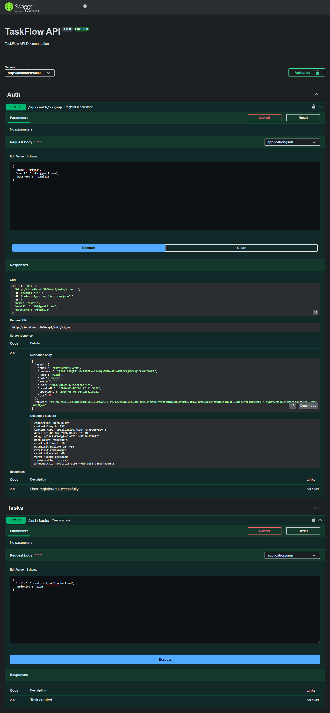
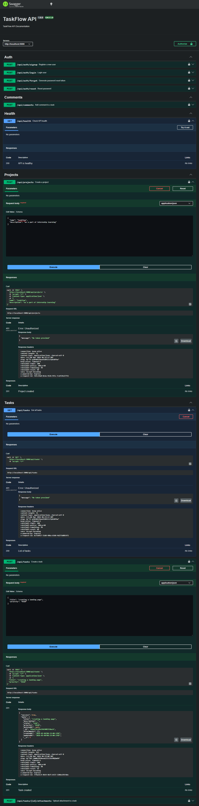

# TaskFlow API

TaskFlow API is a production-grade task management REST API built using **Node.js, Express, TypeScript, MongoDB, and JWT authentication**.  
This project was developed as part of the **Grootan Technologies Internal Training Program**.

The goal of this project is to design a scalable backend system with proper architecture, validation, authentication, testing, file handling, real-time communication, and production readiness.

---

# Project Overview

TaskFlow API allows users to:

- Register and login securely
- Create and manage projects
- Create and manage tasks
- Upload task attachments
- Generate project reports (PDF & CSV)
- Receive real-time task notifications
- Send email notifications
- Access API documentation through Swagger

The project follows a **clean MVC + Service Layer architecture** and includes **comprehensive unit and integration tests**.

---

# Tech Stack

### Backend

- Node.js
- Express.js
- TypeScript

### Database

- MongoDB
- Mongoose

### Authentication & Security

- JWT (jsonwebtoken)
- bcryptjs
- helmet
- cors
- express-rate-limit

### File Handling

- multer
- PDFKit
- CSV export

### Email & Real-time

- nodemailer
- socket.io

### Testing

- Jest
- ts-jest
- supertest
- mongodb-memory-server

### Documentation

- swagger-jsdoc
- swagger-ui-express

---

# Project Architecture

The project follows a **modular folder structure**.

# TaskFlow API

TaskFlow API is a production-grade task management REST API built using **Node.js, Express, TypeScript, MongoDB, and JWT authentication**.  
This project was developed as part of the **Grootan Technologies Internal Training Program**.

The goal of this project is to design a scalable backend system with proper architecture, validation, authentication, testing, file handling, real-time communication, and production readiness.

---

# Project Overview

TaskFlow API allows users to:

- Register and login securely
- Create and manage projects
- Create and manage tasks
- Upload task attachments
- Generate project reports (PDF & CSV)
- Receive real-time task notifications
- Send email notifications
- Access API documentation through Swagger

The project follows a **clean MVC + Service Layer architecture** and includes **comprehensive unit and integration tests**.

---

# Tech Stack

### Backend

- Node.js
- Express.js
- TypeScript

### Database

- MongoDB
- Mongoose

### Authentication & Security

- JWT (jsonwebtoken)
- bcryptjs
- helmet
- cors
- express-rate-limit

### File Handling

- multer
- PDFKit
- CSV export

### Email & Real-time

- nodemailer
- socket.io

### Testing

- Jest
- ts-jest
- supertest
- mongodb-memory-server

### Documentation

- swagger-jsdoc
- swagger-ui-express

---

# Project Architecture

The project follows a **modular folder structure**.

src/
├── controllers
├── middleware
├── models
├── routes
├── services
├── utils
├── validators
├── socket
├── app.ts
└── server.ts

tests/
├── unit
└── integration

Controllers handle requests, services contain business logic, and models define database schemas.

---

# Screenshots

---

# Phase-wise Implementation

The project was implemented in **8 phases**.

---

# Phase 1 – Project Foundation & Express Setup

In this phase, the base structure of the application was created.

Key tasks completed:

- Node.js + TypeScript project setup
- Express server configuration
- Jest testing setup
- MongoMemoryServer for test database
- MVC folder structure
- Health check endpoint

Example endpoint:

GET /api/health

This endpoint returns server status, timestamp, and uptime.

---

# Phase 2 – Database Models

In this phase, MongoDB schemas were designed.

Models implemented:

- **User**
- **Task**
- **Project**
- **Comment**

Key features:

- password hashing using bcrypt
- email validation
- task status and priority fields
- project-member relationships
- threaded comments

---

# Phase 3 – REST API CRUD Endpoints

This phase introduced complete REST API functionality.

Endpoints implemented:

- Create task
- Get tasks
- Update task
- Delete task
- Create project
- Add comments

Example endpoint:

POST /api/tasks

The service layer handles business logic while controllers manage requests.

---

# Phase 4 – Authentication & Authorization

Authentication system was implemented using JWT.

Endpoints:

POST /api/auth/signup
POST /api/auth/login
POST /api/auth/refresh
POST /api/auth/forgot-password
POST /api/auth/reset-password

Features:

- password hashing
- JWT access tokens
- refresh tokens
- protected routes
- password reset flow

---

# Phase 5 – Validation & Error Handling

This phase focuses on application reliability.

Features added:

- request validation using express-validator
- input sanitization
- custom error class
- centralized error handling middleware
- proper HTTP status codes

Example validations:

- title length validation
- email format validation
- future date validation
- ObjectId validation

---

# Phase 6 – File Upload & Report Generation

This phase added file management and reporting features.

Features implemented:

- task attachment upload
- attachment download
- user avatar upload
- project report generation (PDF)
- task export as CSV

Libraries used:

- multer
- PDFKit

Example endpoint:

POST /api/tasks/:id/attachments

---

# Phase 7 – Pagination & Real-time Notifications

Advanced querying and real-time updates were introduced.

Pagination types:

- Offset pagination (page, limit)
- Cursor pagination

Real-time features:

- Socket.io integration
- authenticated socket connections
- project-based rooms

Events implemented:

- task created
- task updated
- task status changed

---

# Phase 8 – Email Notifications & Production Readiness

This phase prepared the application for production.

Email notifications implemented:

- welcome email on signup
- password reset email
- task assignment notification
- daily overdue task digest

Production improvements:

- request logging
- compression middleware
- rate limiting
- request ID tracking
- environment-based configuration

---

# Bonus Challenge – Swagger API Documentation

Swagger documentation was integrated.

Features:

- interactive API documentation
- request/response schema definitions
- authentication support in Swagger UI

Access documentation at:

/api-docs

//Swagger ui

**https://taskflow-api-stml.onrender.com/api-docs**

---

# Installation

Clone the repository.

git clone <repository-url>
cd task3

Install dependencies.

npm install

---

# Environment Variables

Create a `.env` file in the root directory.

Example:

PORT=5000
MONGO_URI=your_mongodb_connection_string
JWT_SECRET=your_secret
JWT_REFRESH_SECRET=your_refresh_secret

---

# Running the Application

Start the development server.

npm run dev

Build the project.

npm run build

Run production server.

npm start

---

# Running Tests

Run the test suite.

npm test

The test suite includes:

- unit tests
- integration tests
- coverage reports

Coverage goal:

80%+

---

# Demo Features

The application can demonstrate:

1. User signup and login
2. Project and task creation
3. Input validation and error responses
4. File upload and download
5. Project PDF report generation
6. Real-time notifications with Socket.io
7. Running test suite with coverage
8. Swagger API documentation

---

# Author

Developed as part of the **Grootan Technologies Internal Training Program**.

---

# License

This project is intended for learning and evaluation purposes.
